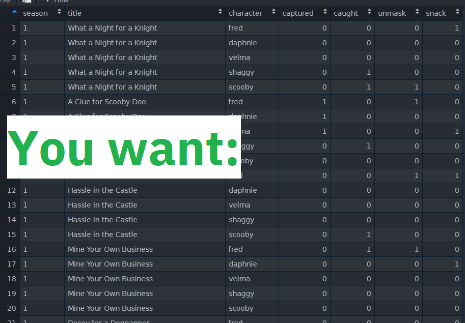
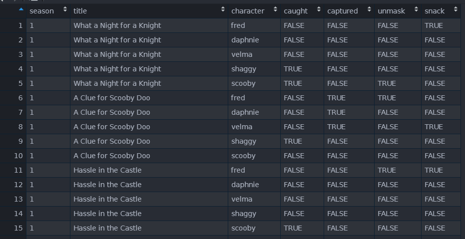
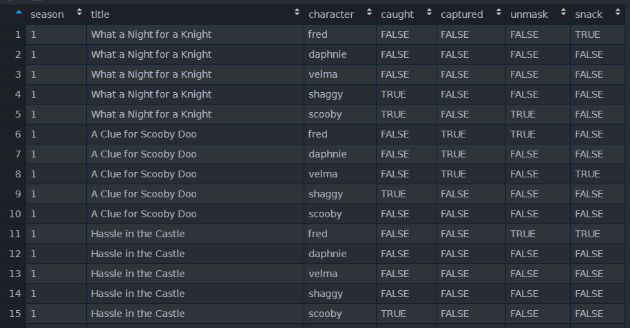


Transcribing [one](https://twitter.com/_tanho/status/1415100126272577536) of my 
more popular Twitter posts into a website post now that I'm mostly off of Twitter. 


One of my favourite data-wrangling tricks is [tidyr::pivot_longer's](https://tidyr.tidyverse.org/reference/pivot_longer.html) 
`names_to` & `.value` sentinel - use-cases don't come up often, but it's so deeply
:sparkles: **satisfying** :sparkles: when it does!

Let's say you have this starting dataframe:


and you want this ending dataframe:



How do you extract the characters (Fred, Velma, Daphnie, Shaggy, Scooby) from the
column names into a `character` column?


TLDR: Full gist [here](https://gist.github.com/tanho63/50d9b323e29165ad3e027bc3cf1c5926).


Past me: hmm, well, I can pivot_longer, then separate the name, then pivot_wider again?

```r
three_lines <- x %>% 
  pivot_longer(cols = -c("season","title")) %>% 
  separate(name,into = c("action","character"), sep = "_") %>% 
  pivot_wider(names_from = "action", values_from = "value")
```

returns



This seems to work okay! 

**But what if I told you there's a one-liner for this exact situation?**

pivot_longer has a "names_to" argument that takes a special "sentinel value" 
called `".value"` - it immediately re-pivots the columns so that "character" 
(fred, daphne etc) stays as a column and then the ".value" part becomes colnames
again (caught, captured etc)

```r
one_line <- x %>% 
  pivot_longer(
    cols = -c("season","title"), 
    names_to = c(".value","character"), 
    names_sep = "_"
  )
```



**Why use many line when one line do trick?**

You can read more about this pivot_longer feature in this [tidyr vignette](https://tidyr.tidyverse.org/articles/pivot.html#multiple-observations-per-row).


