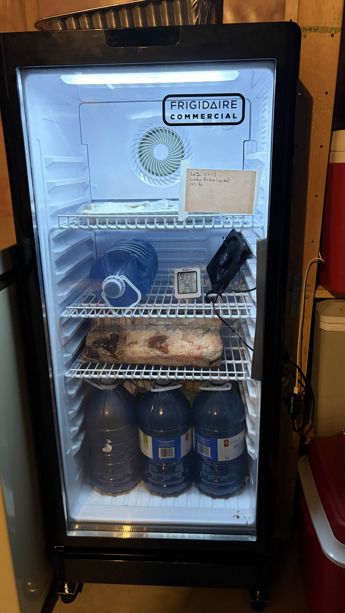
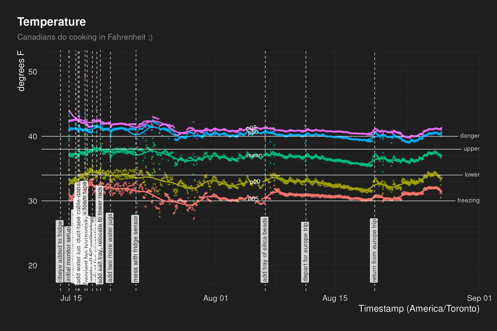
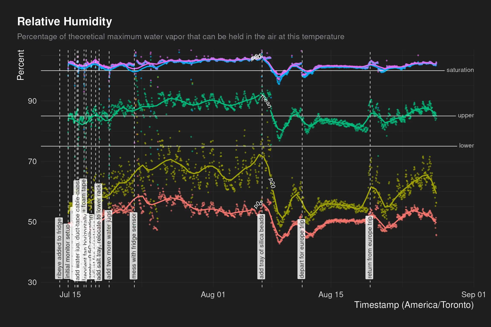

One of my deep nerd obsessions is food, especially food science, and I've long
wanted to try out dry-aging at home. The premise sounds "simple": you just need a
dedicated fridge, a big old hunk of meat, and a way to monitor the temperature
and humidity inside. Pair that with some burgeoning homelab skills and ... how
hard could it be? Here are some reflections on my first dry-aging experiment, a
45-day boneless ribeye roast.

Code for this project lives on GitHub at [tanho63/dry-age-monitor](https://github.com/tanho63/dry-age-monitor).

## equipment and setup

I got a [dedicated fridge](https://www.costco.ca/frigidaire-21-in.-6.0-cu-ft.-commercial-glass-display-refrigerator.product.4000409375.html)
from Costco - around 6.0 cubic feet with a glass door and wire shelving - and on
balance I think it worked really well: it held humidity pretty decently, was
able to fit a good sized chunk of meat on a shelf, and the glass door let me
look in on it whenever I wanted. The one downside is that it uses a mechanical
thermostat for deciding when to kick on the compressor, and I ended up needing
to fiddle with it a bit (more on that later). A digital thermostat that let me
control top-end and bottom-end temperature would probably be better, but honestly
I'm very pleased with what I got for ~$350 CAD.

The Raspberry Pi monitoring setup worked great for tracking temperature and
humidity. I've mostly had experience with the Pi Zero 2 WH (i.e. with headers already
soldered on), so went with that and paired it with a [BME690](https://www.pishop.ca/product/bme690-4-in-1-air-quality-breakout-gas-temperature-pressure-humidity/)
air quality sensor that promised to monitor temperature, humidity, gas, and
pressure. I could probably have cheaped out and gone with a simpler sensor like
the [AHT20](https://shop.pimoroni.com/products/adafruit-aht20-temperature-humidity-sensor-breakout-board-stemma-qt-qwiic?variant=32004099801171),
since the gas and pressure turned out to be pretty useless, but the BME690
worked well enough once I got it set up and calibrated.

I don't have a soldering kit, so plugging everything in via Stemma/QT cables was
the move and it was painless. I made sure to get a longer (400mm) cable for the
sensor-to-hub connection so that I could put the sensor closer to the middle of
the fridge, and then used a velcro cable tie to secure it to the desired fridge
rack. I didn't have any worries about the sensor breakout board being exposed to
cold temperatures or potential humidity, since it is designed to read those, and
the actual Pi is mounted outside of the fridge.

I used a spare [computer case fan](https://www.canadacomputers.com/en/case-fans/249387/be-quiet-pure-wings-3-120mm-case-fan-bl104.html)
I already had, paired with this USB-powered [fan controller](https://www.amazon.ca/dp/B0DPZM7T3Q).
I initially tried a [USB fan](https://www.amazon.ca/dp/B06Y5WWBHH?th=1), but the
cable was pretty thick and awkward to fit into the fridge's door seal. The case
fan's cable was much thinner and easier to route, and the adjustable fan speed
was pretty useful too. I didn't end up needing to adjust it very often at all
because I found that a higher fan speed messed with the temperature more than I
wanted while not really changing the effective humidity much at all.

Sealing off the cable gaps in the door gasket was very helpful in maintaining
temperature. I duct-taped the cables down first to make sure it stayed put, then
put foam tape over top to help reduce air leakage.

I bought a [cheap thermohygrometer](https://temppro.com/products/tp50-digital-indoor-hygrometer-thermometer)
as a backup in case the Pi ever went down. It worked fine as a sanity check but
I'd want to invest in a better one if I was relying on it directly.

## meat

I was a bit impulsive about buying the meat: I'd had the fridge for a while, but
had been procrastinating actually starting on everything, so one day I was at
Costco Business Centre and decided to just get a starter piece of meat for the
sake of giving myself a kick in the pants.

The beef I ended up with for this first experiment was an ungraded, boneless ribeye
roast weighing 14.2 lbs. Not a particularly great one either: the fat cap was
thick, the meat wasn't especially marbled, and the spinalis was thinner than I'd
have liked. I mostly wanted to get a roast I wouldn't be too upset about ruining
if the experiment flopped.

I didn't do a great job of documenting the "before" state: I forgot to log the
total cost and size of the whole roast before trimming, so I can't do a really good
cost estimate, but I did remember to portion off a steak so I could have a
before/after comparison tasting. I also trimmed it up so that it would fit
horizontally on the shelf with some space for airflow around the sides.

My goal was to age this first roast for 45 days. I've had 30-day dry-aged steaks
before, so with my home experimentation I really wanted to try going for a
meaningful increase but not necessarily going all the way to 60 days (which the
research suggests is potentially quite overpowering).

## monitoring

I set up the Pi to record data (temp, humidity, pressure, gas) every 30 seconds,
which gave me a pretty good representation of the fridge cycle, and I calculated
the mean values for the whole up/down fridge cycle as well as the 5th, 20th,
80th, and 95th percentile values (avoiding outliers in case I opened the fridge
momentarily).

I put together an R Markdown report to summarize the data, and set it up to knit
via a cron job every 15 minutes on my main home server rather than on the Pi
itself (which was too underpowered). I also chose to push the report to an
[S3 bucket page](https://s3.tan.gg/dry-age-monitor) rather than continually
committing it to GitHub like I might have in the past (lots of images being
committed that often would lead to repository size growing indefinitely).

### temperature

Temperature-wise, the internet says that dry-age temperatures should be between
34F and 38F, that meat freezes at about 30F, and that the danger zone from a food
safety perspective starts at 40F. I decided to shoot for:

- mean cycle temp between 36F and 38F
- 5th and 20th percentiles above 30F
- 95th percentile at or below 41F
- 80th percentile at or below 40F

These felt like reasonable goals because the meat itself shouldn't actually reach
over 41F - the sensor reacts to air temperature swings much faster than the
meat's surface does. I also wanted to avoid short-cycling the fridge compressor,
which would reduce the lifespan of the fridge and also probably cost more money
to run overall.

Unfortunately, my fridge's cycle maxes and mins seemed to naturally range between
32F and 42F, even on the coldest fridge setting. While I was willing to risk a
small portion (less than 20%) of the time being between 40F and 41F, I was
worried that any more time than that, or any warmer a band, would be more likely
to cause spoilage and "bad" bacteria growth.

I tried increasing fan speed, thinking that it would circulate cold air up faster.
However, this didn't really change the set-point of the fridge's thermostat: the
cooling happened faster since the cold air would circulate more quickly on the
"down" part of the cycle, but the compressor didn't kick on any earlier.

I ended up messing with the fridge's thermostat sensor itself: this is basically
a wire that sat in a little housing on the back of the fridge, so I took the
housing off and bent the wire upwards to move the end of the sensor into a
warmer spot of the fridge. This kicked the compressor on a little earlier (~41F)
and also caused it to turn off a bit later (~28F), since it took longer for the
"cold" to register on the sensor. That latter part was easy to fix: just turn
the dial down!

I also wanted to try to lengthen the cycle to help the fridge run a little more
efficiently, so I added some thermal mass in the form of 4L jugs of water - this
helped slow the rate at which the fridge warmed between the compressor shutting
off and kicking on again.

### humidity

Humidity seemed to sit really high throughout the process, swinging from 50% to
100%+, according to the BME690 sensor. This led to some worries about condensation
forming on either the meat or on the walls of the fridge (and eventually ice).
My research suggested that the meat would give off moisture for at least 2-3 weeks,
so I just added a quarter sheet pan of kosher salt hoping that it would resolve
itself eventually.

This didn't really happen: humidity levels stayed basically the same, so I replaced
the salt with a quarter sheet pan of silica beads (making sure to orient the fan to
blow air across the tray but not allowing the meat to touch the silica at all).
This made a meaningful difference in bringing down the humidity, but only lasted
a short while and needed replacing about every week.

Interestingly, when I left for a one-week trip to Croatia, the humidity **declined**
steadily while I was away, but somehow spiked immediately **before** I got home.
This clued me in to a potential reason why the humidity was sitting so high:
when I left, I turned the house's AC off and programmed it to turn back on
shortly before I got back from the trip. The fridge is in the same room as the
HVAC, and that room gets warmer and more humid when either the heating or air conditioning is running. The fridge pulls that humid air in, which keeps the
internal humidity high even after the meat has lost the moisture it was always
going to lose.

## tasting notes

{{< gallery images="{04_dry_age.jpg,03_dry_age_sliced.jpg,02_steaks.jpg}" >}}

- Starting weight: 14.2 lbs
- Ending weight: 12.36 lbs (13% loss)
- Post-trim weight: ~9 lbs (largeish fat cap mostly to blame), cut into 10 steaks
  about 1.5" thick and between 12 and 14 oz each.

The dry-aged taste was noticeable but not overpowering (especially since I had been
semi-aggressive in trimming off the pellicle) - really tasty! I'm very satisfied
with the results. Haven't tried a before/after comparison of flavour and tenderness
yet - I think I'm saving that for when Mi Yen is home next.

## thoughts for next time

- get a larger subprimal with bone + meat to protect the main steak, something like a [107](https://www.chefs-resources.com/types-of-meat/beef/cuts-of-beef/prime-rib/)
- try hanging vertically via meat hooks instead of being constrained by the shelf width
- go for only a little bit more time (maybe 50 days?)
- investigate inoculating fridge/meat with mold
- move fridge into a different room to be less sensitive to temp/humidity swings?

All in all: delicious, 10/10 would do again - maybe even this week to be ready
before my birthday in November?
