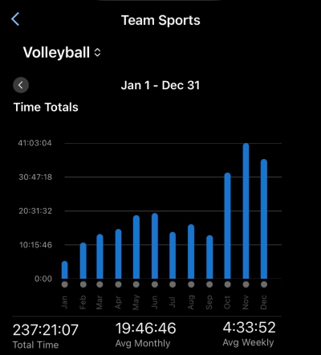

2025 is in the books. What do I want to remember about it?

- I (officially) became an engineering manager in April - there's a lot to unpack
here and I probably want to do so in more detail eventually. I had felt like I
was already pseudo team lead and that being the official engineering manager
wouldn't be that much different - in hindsight, I think I was very unprepared for
how much "corporate politicking" and "managerial nonsense" came with the role
and how much it would take up of my time. My work has transitioned into a lot
more effort leading the engineering planning and project scoping, followed by
spending a solid amount of time reviewing work and mentoring reports, and a much
smaller fraction of my time is actively hands on keyboard coding work. I'm
pretty satisfied with these changes, although I'd like to try to reduce some of
the admin overhead to get closer to a 25-30% individual contributor time rather
than 10-15% as it is right now. I'm grateful for the team I have worked with
over the last year - Lydia, Andrew, Michael, Yagmur, and Danny - and for all of
the lessons they've taught me along the way.

- I'm not doing a lot of freelance work right now, or really any major side
projects. nflverse, ffverse, and dynastyprocess continue to be dormant and/or on
maintenance mode.

<figure class="flex justify-center">
  
</figure>

- In the fall of 2024, I started playing indoor volleyball during Friday night
sports for the first time since high school gym class and enjoyed it enough that
I thought I would try to pick it up as a standalone recreational sport in
January by signing up for a volleyball play-and-social as well as a training
session. This snowballed over 2025 and I found myself playing over 30 hours per
month of volleyball by October, totalling over 237 hours for the year. It's
incredibly funny to me that I keep getting hooked on "tall people" sports, and
the obsession with volleyball has somehow surpassed even the peak I had with
rowing (41 hours in Nov 2025 vs 36 hours of rowing in Aug 2018). There's
something really nice about the way it's a team sport social enough to make
friends while playing it, non-contact in a way that "invasion" sports like
basketball/soccer/ultimate aren't (which helps avoid "physical" dominance, makes
playing coed more viable/fun, and overall reduces injury risk), and technically
challenging enough that I could play well at the start but still had a lot of
room to learn new skills. I'm finding that the best volleyball I get to play has
been Javelin's intermediate level drop-in (where I'm learning how to play setter
in a 5-1 system), as well as Volley Sixes for league play and Lima Sports Club
for training. I'd probably enjoy Capital Volley more if I was on a higher-level
team, and I'd be interested in trying out OFSL in the future. I probably would
never play an OSSC league again for serious play - levels are too unbalanced for
it to really stick.

- I swam a decent amount to start the year, but phased that out for volleyball
in the summer after finding that I was getting better at volleyball and that I
preferred a more team-based social/accountability. I kind of liked the steady
state cardio aspect of swimming and the gradual improvement, but playing vb does
somewhat address the cardio too. I'd like to add back some lifting and other
training next year, perhaps plyometrics to supplement the volleyball?

- I've made a lot more local friends in the last year and have a bit less focus
on global friends as a result. Feeling a little less on the outskirts of the
Friday night sports friend groups than I was this time last year, especially
after attending Bluesfest with the group as well as consistently doing pub
nights and karaoke socials etc. I'm looking forward to a Tremblant ski trip at
the end of February, although I'm a bit concerned my MCLs won't hold up super
well having not really skiied in the last few years.

- I travelled a lot less than previous years, a lot of which was owing to not
wanting to break the physical activity routines I was on. Places I did visit:
  - Kansas City, where I got to hang out with Sid and saw KC vs BUF in the AFC
  championship game
  - Houston for ASI conference
  - Gaspé for a road trip with Mom and Dad and Jasper
  - Atlanta for PositConf 2025 (where I got to hang out with Lydia and Arielle!)
  - London for Hudl (f/k/a Statsbomb) 2025 and to visit Mimio

- Given the state of global politics, I might be travelling even less next year.

- I attended three conferences (ASI, Posit, Hudl) and successfully managed to
not give a talk at any of them! This is exciting because in 2024 I tried to
avoid it and somehow still managed to get roped into giving a talk at Shiny in
Production. I did appear on the [Data Science Hangout](posts/talks/2025-10_dshangout/)
with Libby, which was super fun!

- My weight is down a decent amount from the increased physical activity despite
not actively making this a focus. I think I should give this a little bit more
effort again soon - especially if I want to try adding skiing back to the
activity mix in upcoming years. My sleep and adhd medications have both improved
my overall mood and outlook this year, which I'm very grateful for.

- For the first time ever (at least since I've started writing reflections) it
feels like I've made progress on multiple fronts this past year - work, finance,
physical activity, physical health, social all seemed to improve in 2025. I've
bemoaned the lack of balance in the past, but between the nuances of managerial
work "reducing" the IC load (which was easy to overdo) and the new obsession
with volleyball, I've definitely felt a lot more balanced out lately. I'm still
a little more lonely than I would like to be, and getting out into the dating
scene still feels daunting.

On to 2026!
